# PakaiLink QRIS Transaction Flow

```mermaid
flowchart TD
    Start([Start]) --> InitClient[Initialize PakaiLink Client]
    InitClient --> Config{Configuration Valid?}
    
    Config -->|No| Error[Error: Invalid Config]
    Config -->|Yes| GetToken[Get Access Token]
    
    GetToken --> AuthReq[POST /snap/v1.0/access-token/b2b]
    AuthReq --> AuthSig[Generate SHA256WithRSA Signature]
    AuthSig --> AuthHeaders[Set Headers:<br/>X-TIMESTAMP<br/>X-CLIENT-KEY<br/>X-SIGNATURE]
    AuthHeaders --> TokenResponse{Access Token Received?}
    
    TokenResponse -->|No| AuthError[Error: Authentication Failed]
    TokenResponse -->|Yes| CreateQRIS[Create QRIS Transaction]
    
    CreateQRIS --> QRISReq[Prepare QRIS Request]
    QRISReq --> QRISPayload[Build Payload:<br/>merchantId<br/>storeId<br/>terminalId<br/>partnerReferenceNo<br/>amount<br/>validityPeriod<br/>callbackUrl]
    
    QRISPayload --> GenTerminal[Generate Terminal ID]
    GenTerminal --> QRISBody[Create Request Body]
    
    QRISBody --> QRISAuth[Get Bearer Token]
    QRISAuth --> QRISGenSig[Generate Transaction Signature]
    QRISGenSig --> QRISStringToSign[Build String to Sign:<br/>METHOD:ENDPOINT:TOKEN:<br/>LOWER SHA256 BODY:TIMESTAMP]
    QRISStringToSign --> QRISHMAC[HMAC-SHA512 with Client Secret]
    QRISHMAC --> QRISBase64[Base64 Encode Signature]
    
    QRISBase64 --> QRISHeaders[Set Headers:<br/>Authorization: Bearer Token<br/>X-EXTERNAL-ID<br/>CHANNEL-ID<br/>X-PARTNER-ID<br/>X-TIMESTAMP<br/>X-SIGNATURE]
    
    QRISHeaders --> QRISAPI[POST /snap/v1.0/qr/qr-mpm-generate]
    QRISAPI --> QRISResponse{QRIS Response}
    
    QRISResponse -->|Error| QRISError[Error: QRIS Generation Failed]
    QRISResponse -->|Success| QRISData[Extract QRIS Data:<br/>qrContent<br/>referenceNo<br/>validityPeriod<br/>merchantName]
    
    QRISData --> DisplayQR[Display QR Code to Customer]
    DisplayQR --> CustomerScan[Customer Scans QR Code]
    
    CustomerScan --> PaymentApp[Customer Payment App]
    PaymentApp --> PaymentProcess[Payment Processing]
    PaymentProcess --> PaymentProvider[Payment Provider Network]
    PaymentProvider --> BankNetwork[Bank Network]
    BankNetwork --> PakaiLink[PakaiLink Server]
    
    PakaiLink --> ValidateCallback[Validate Callback Signature]
    ValidateCallback --> CallbackSig[Verify SHA256WithRSA Signature]
    CallbackSig --> CallbackValid{Signature Valid?}
    
    CallbackValid -->|No| RejectCallback[Reject Callback]
    CallbackValid -->|Yes| ProcessCallback[Process Payment Callback]
    
    ProcessCallback --> UpdateStatus[Update Transaction Status]
    UpdateStatus --> NotifyMerchant[Notify Merchant System]
    
    NotifyMerchant --> CheckStatus[Check Transaction Status]
    CheckStatus --> StatusReq[POST /snap/v1.0/qr/qr-mpm-status]
    StatusReq --> StatusPayload[Build Status Request:<br/>originalPartnerReferenceNo]
    
    StatusPayload --> StatusAuth[Get Bearer Token]
    StatusAuth --> StatusSig[Generate Transaction Signature]
    StatusSig --> StatusHeaders[Set Headers]
    StatusHeaders --> StatusAPI[Call Status API]
    
    StatusAPI --> StatusResponse{Transaction Status}
    StatusResponse -->|Pending| WaitPayment[Wait for Payment]
    WaitPayment --> CheckStatus
    
    StatusResponse -->|Success| PaymentSuccess[Payment Successful]
    StatusResponse -->|Failed| PaymentFailed[Payment Failed]
    StatusResponse -->|Expired| PaymentExpired[Payment Expired]
    
    PaymentSuccess --> UpdateDatabase[Update Database]
    PaymentFailed --> UpdateFailed[Update Failed Status]
    PaymentExpired --> UpdateExpired[Update Expired Status]
    
    UpdateDatabase --> SendReceipt[Send Receipt]
    UpdateFailed --> NotifyFailure[Notify Failure]
    UpdateExpired --> NotifyExpiry[Notify Expiry]
    
    SendReceipt --> Complete([Transaction Complete])
    NotifyFailure --> Complete
    NotifyExpiry --> Complete
    
    Error --> Complete
    AuthError --> Complete
    QRISError --> Complete
    RejectCallback --> Complete
    
    %% Styling
    classDef process fill:#e1f5fe
    classDef decision fill:#fff3e0
    classDef error fill:#ffebee
    classDef success fill:#e8f5e8
    classDef api fill:#f3e5f5
    
    class InitClient,GetToken,CreateQRIS,QRISReq,QRISPayload,GenTerminal,QRISBody,QRISAuth,QRISGenSig,QRISStringToSign,QRISHMAC,QRISBase64,QRISHeaders,QRISAPI,DisplayQR,CustomerScan,PaymentProcess,PaymentProvider,BankNetwork,PakaiLink,ValidateCallback,CallbackSig,ProcessCallback,UpdateStatus,NotifyMerchant,CheckStatus,StatusReq,StatusPayload,StatusAuth,StatusSig,StatusHeaders,StatusAPI,WaitPayment,PaymentSuccess,UpdateDatabase,SendReceipt,UpdateFailed,UpdateExpired,NotifyFailure,NotifyExpiry process
    
    class Config,TokenResponse,QRISResponse,CallbackValid,StatusResponse decision
    
    class Error,AuthError,QRISError,RejectCallback,PaymentFailed,PaymentExpired error
    
    class Complete,PaymentSuccess success
    
    class AuthReq,QRISAPI,StatusAPI api
```

## Flow Description

### 1. Initialization Phase
- **Initialize PakaiLink Client**: Create client instance with configuration (BaseURL, PrivateKey, PublicKey, PartnerID, ClientKey, ClientSecret, ChannelID, QRISMerchantID, QRISStoreID, CallbackURL)
- **Get Access Token**: Authenticate using client credentials with SHA256WithRSA signature

### 2. QRIS Generation Phase
- **Create QRIS Transaction**: Generate QRIS MPM code with merchant details
- **Generate Terminal ID**: Create unique terminal identifier
- **Build Payload**: Include merchantId, storeId, terminalId, partnerReferenceNo, amount, validityPeriod, callbackUrl
- **Generate Transaction Signature**: Create HMAC-SHA512 signature using string-to-sign format
- **API Call**: POST to `/snap/v1.0/qr/qr-mpm-generate` with proper headers

### 3. Payment Processing Phase
- **Display QR Code**: Show QR content to customer
- **Customer Scans**: Customer uses payment app to scan QR
- **Payment Flow**: Payment app → Payment provider → Bank network → PakaiLink server

### 4. Callback Processing Phase
- **Validate Callback**: Verify SHA256WithRSA signature using public key
- **Process Payment**: Update transaction status and notify merchant

### 5. Status Verification Phase
- **Check Status**: Query transaction status using `/snap/v1.0/qr/qr-mpm-status`
- **Handle States**: Process pending, success, failed, or expired states
- **Update System**: Update database and send appropriate notifications

## Security Features
- **Dual Signature Validation**: SHA256WithRSA for authentication, HMAC-SHA512 for transactions
- **Token-based Authentication**: Bearer token for API access
- **Callback Verification**: Signature validation for incoming callbacks
- **Timestamp Validation**: Prevent replay attacks

## Error Handling
- **Configuration Errors**: Invalid credentials or missing parameters
- **Authentication Errors**: Failed token generation
- **API Errors**: QRIS generation failures
- **Payment Errors**: Failed or expired transactions
- **Signature Errors**: Invalid callback signatures
